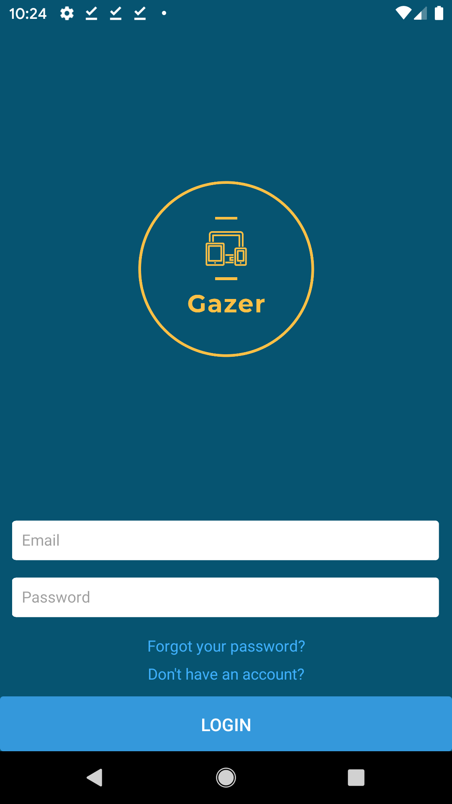
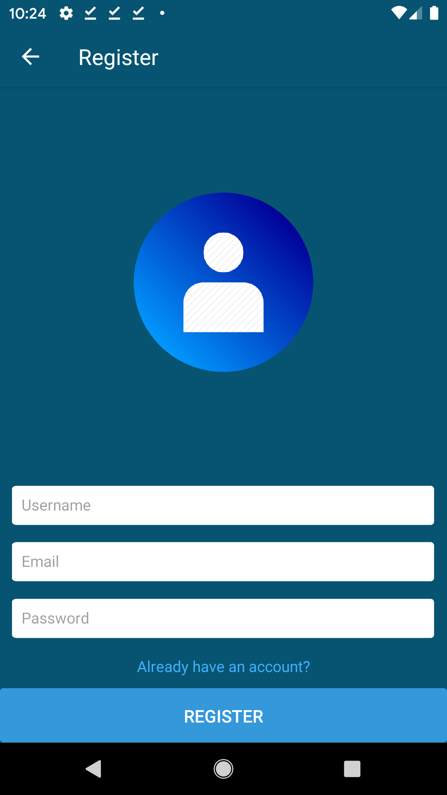
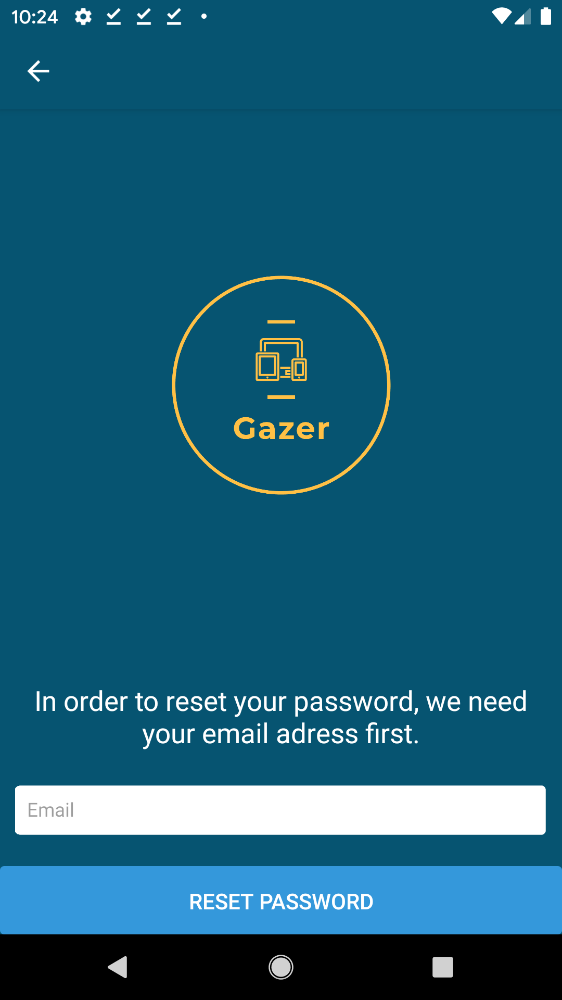
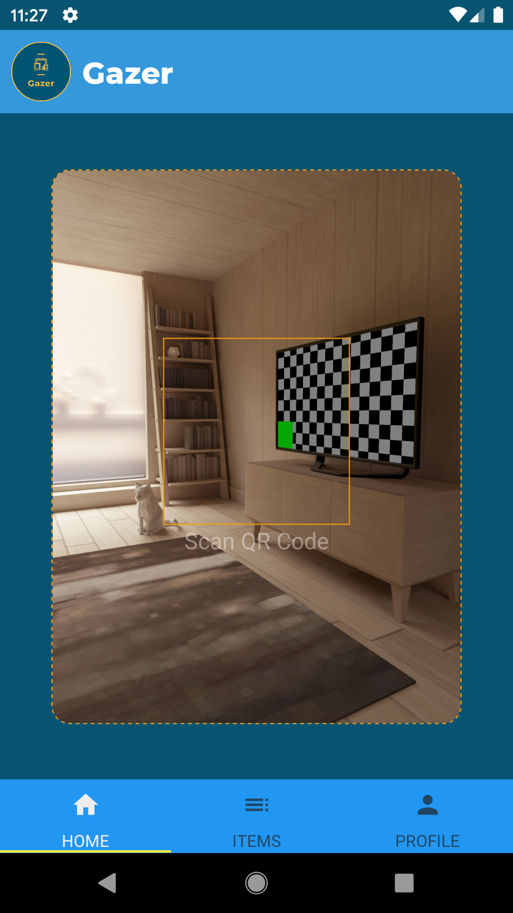
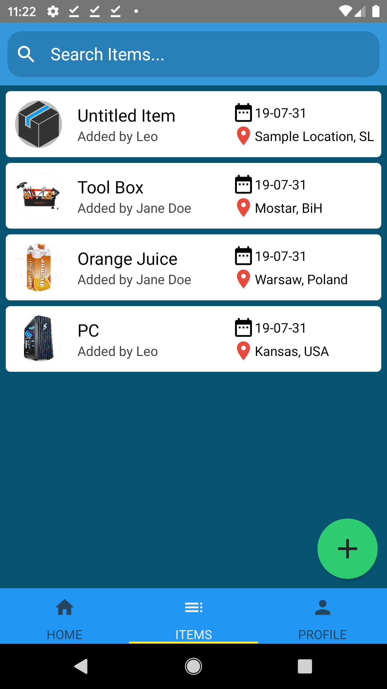
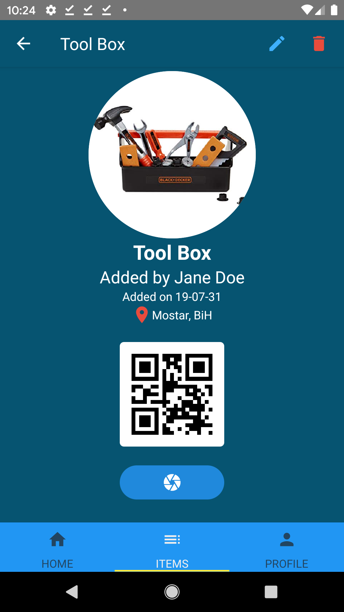
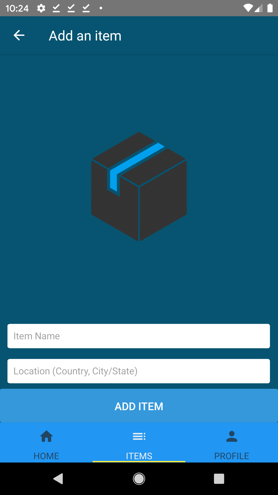
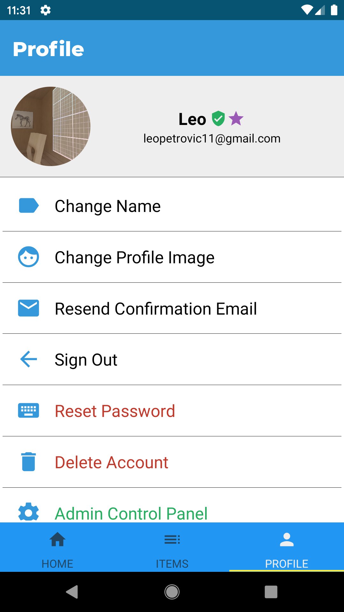

# Gazer

A Utility Inventory Manager (UIM) Business Mobile App

*Gazer - a person who gazes, i.e. watches/browses*

**To-Do:**

- [x] Register Firebase account and setup work environment
- [x] Make basic App template/skeleton
- [x] Implement the screens from the general design of the App
- [x] Style App and establish App theme
- [x] Complete Login system
- [x] Complete Register system
- [x] Complete Image upload on Register
- [x] Implement Profile screen header
- [ ] Configure email verification and add email verification screen
- [x] Implement forgotten password system
- [ ] Implement email-verified-only features for profiles
- [ ] Add Item display, creation, edition, and deletion system
- [x] Implement search system for items
- [ ] Implement Admin profiles
- [ ] Polish app (broad)

**Sample Images:**

  

  

  

  
